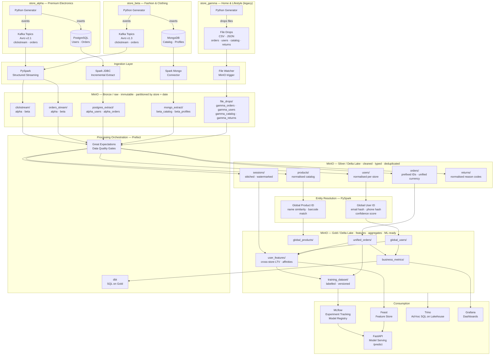

```mermaid
flowchart TD
    subgraph SRC_A["store_alpha — Premium Electronics"]
        A_GEN[Python Generator]
        A_PG[(PostgreSQL\nUsers · Orders)]
        A_KAFKA[Kafka Topics\nAvro v2.1\nclickstream · orders]
    end

    subgraph SRC_B["store_beta — Fashion & Clothing"]
        B_GEN[Python Generator]
        B_MONGO[(MongoDB\nCatalog · Profiles)]
        B_KAFKA[Kafka Topics\nAvro v1.3\nclickstream · orders]
    end

    subgraph SRC_G["store_gamma — Home & Lifestyle (legacy)"]
        G_GEN[Python Generator]
        G_FILES[File Drops\nCSV · JSON\norders · users · catalog · returns]
    end

    subgraph INGEST["Ingestion Layer"]
        STREAM[PySpark\nStructured Streaming]
        JDBC[Spark JDBC\nIncremental Extract]
        MONGO_SPARK[Spark Mongo\nConnector]
        FILE_INGEST[File Watcher\nMinIO trigger]
    end

    subgraph BRONZE["MinIO — Bronze  /  raw · immutable · partitioned by store + date"]
        BR_CL[clickstream/\nalpha · beta]
        BR_ORD[orders_stream/\nalpha · beta]
        BR_PG[postgres_extract/\nalpha_users · alpha_orders]
        BR_MG[mongo_extract/\nbeta_catalog · beta_profiles]
        BR_FL[file_drops/\ngamma_orders · gamma_users\ngamma_catalog · gamma_returns]
    end

    subgraph SILVER["MinIO — Silver  /  Delta Lake · cleaned · typed · deduplicated"]
        SI_USERS[users/\nnormalised per store]
        SI_ORDERS[orders/\nprefixed IDs · unified currency]
        SI_PRODUCTS[products/\nnormalised catalog]
        SI_CLICKS[sessions/\nstitched · watermarked]
        SI_RETURNS[returns/\nnormalised reason codes]
    end

    subgraph RESOLVE["Entity Resolution  —  PySpark"]
        ER_USER[Global User ID\nemail hash · phone hash\nconfidence score]
        ER_PROD[Global Product ID\nname similarity · barcode match]
    end

    subgraph GOLD["MinIO — Gold  /  Delta Lake · features · aggregates · ML-ready"]
        GO_USERS[global_users/]
        GO_PRODS[global_products/]
        GO_ORDERS[unified_orders/]
        GO_FEAT[user_features/\ncross-store LTV · affinities]
        GO_TRAIN[training_dataset/\nlabelled · versioned]
        GO_METRICS[business_metrics/]
    end

    subgraph PROC["Processing Orchestration — Prefect"]
        GX[Great Expectations\nData Quality Gates]
        DBT[dbt\nSQL on Gold]
    end

    subgraph CONSUME["Consumption"]
        FEAST[Feast\nFeature Store]
        MLFLOW[MLflow\nExperiment Tracking\nModel Registry]
        FASTAPI[FastAPI\nModel Serving\n/predict]
        TRINO[Trino\nAd-hoc SQL on Lakehouse]
        GRAFANA[Grafana\nDashboards]
    end

    A_GEN -->|events| A_KAFKA
    A_GEN -->|inserts| A_PG
    B_GEN -->|events| B_KAFKA
    B_GEN -->|inserts| B_MONGO
    G_GEN -->|drops files| G_FILES

    A_KAFKA --> STREAM --> BR_CL & BR_ORD
    B_KAFKA --> STREAM

    A_PG --> JDBC --> BR_PG
    B_MONGO --> MONGO_SPARK --> BR_MG
    G_FILES --> FILE_INGEST --> BR_FL

    BR_CL & BR_ORD & BR_PG & BR_MG & BR_FL --> GX
    GX --> SI_USERS & SI_ORDERS & SI_PRODUCTS & SI_CLICKS & SI_RETURNS

    SI_USERS --> ER_USER --> GO_USERS
    SI_PRODUCTS --> ER_PROD --> GO_PRODS
    SI_ORDERS --> GO_ORDERS
    SI_CLICKS & GO_USERS & GO_ORDERS --> GO_FEAT
    GO_FEAT & GO_ORDERS --> GO_TRAIN
    GO_ORDERS & GO_USERS --> GO_METRICS

    GO_METRICS --> DBT
    GO_FEAT --> FEAST
    GO_TRAIN --> MLFLOW
    MLFLOW --> FASTAPI
    FEAST --> FASTAPI
    GO_METRICS --> GRAFANA
    GOLD --> TRINO
```